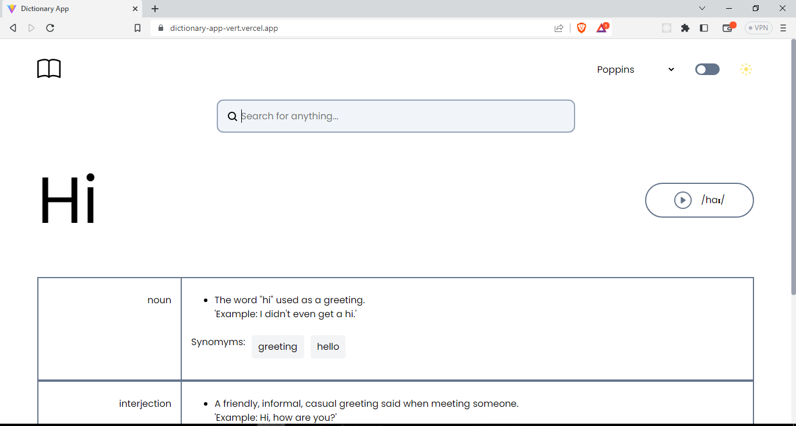
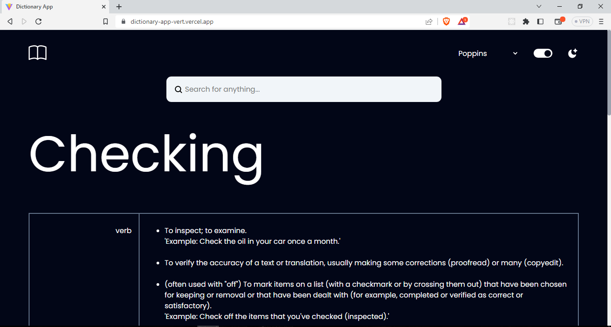

# Introduction

This project was built with HTML, CSS, JavaScript. Searched word are being fetched using JavaScript native fetch method from the [free dictionary API](https://dictionaryapi.dev/), [Github link](https://github.com/meetDeveloper/freeDictionaryAPI).

## Usage

```
Get word definitions with your param <word>
The basic syntax of a URL request to the API is shown below:

https://api.dictionaryapi.dev/api/v2/entries/en/<word>


```

### This project include

- [x] Theme, Prefers-color-scheme
- [x] Font selection

#### Preview Images



<br/>


